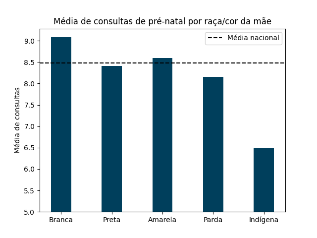

# Análise de dados

Vamos analisar a relação entre a raça/cor da mãe e os cuidados com a saúde materna. Para isso, vamos considerar três aspectos:
a quantidade de consultas pré-natal realizadas, o local de nascimento do bebê e o tipo de parto (normal ou cesário).

## Consultas pré-natal

A tabela abaixo mostra a quantidade de consultas pré-natal realizadas por raça/cor da mãe, junto com a média de consultas.

|   RACACORMAE |   NUMCONSULTAS |   NUMREGISTROS |   MEDIA |
|-------------:|---------------:|---------------:|--------:|
|       Branca |        7288007 |         802475 |    9,08 |
|        Negra |        1358606 |         161600 |    8,41 |
|      Amarela |          93870 |          10915 |    8,60 |
|        Parda |       10462514 |        1284167 |    8,15 |
|     Indígena |         146291 |          22497 |    6,50 |

Podemos plotar esses dados em um gráfico de barras para comparar as médias
entre as raças/cor e a média nacional de consultas.

Veja que a média nacional é de aproximadamente 8,48 consultas. Mas o número de consultas pré-natal varia bastante entre as raças/cor. As mães brancas são as que mais realizam consultas pré-natal, com uma média de 9,08 consultas. Já as mães indígenas são as que menos realizam consultas pré-natal, com uma média de 6,50 consultas. Isso se deve ao fato de que muitas das mães indígenas vivem em regiões mais afastadas e de difícil acesso, o que dificulta o acesso aos serviços de saúde.