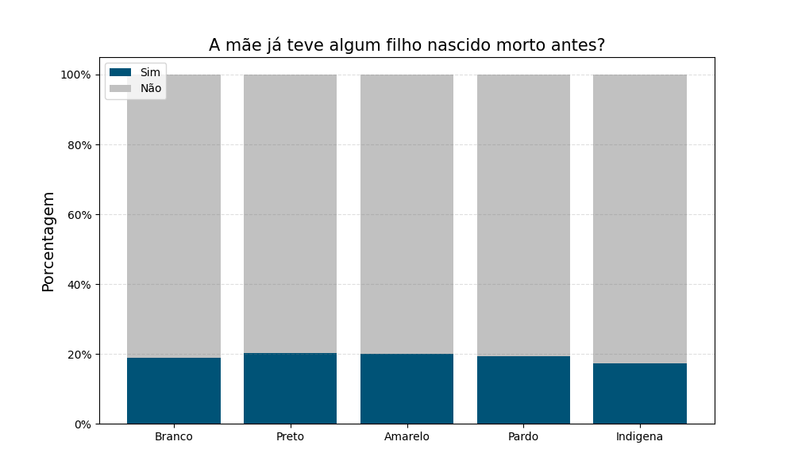

# Análise da saúde neonatal por cor

Dentre os vários parâmetros possíveis de se mensurar a saúde do recém-nascido, optamos por
utilizar o peso ao nascer, o índice APGAR e a quantidade total de nascidos, vivos ou não.

## Indice APGAR5

O índice APGAR avalia o ajuste imediato do recém-nascido à vida extrauterina, por isto é um acrônimo para **A**ppearance, **P**ulse, **G**rimace, **A**ctivity, **R**espiration. Normalmente é feito duas vezes, no 1º e no 5º minuto após o nascimento, e varia de 0 a 10 para indicar se existe uma asfixia grave (0 a 2), moderada (3 e 4), leve (5 a 7) ou inexistente (8 a 10) no bebê.

Sendo uma avaliação pontual, ele pode indicar se o recém-nascido requer atenção médica mais urgente ou não e é influenciado principalmente pelo risco da gravidez, pelas complicações que surgem no parto e a prematuridade do nascimento.
Embora o resultado da escala de APGAR não consiga prever problemas na saúde do bebê no futuro, existe um maior risco de doenças como paralisia cerebral e epilepsia quando os resultados são muito baixos.

Isto nos permite perguntar não só qual a proporção que os baixos valores atingem na população como também sua incidência entre os diferentes grupos que a compõem. Escolhemos, por isso, analisar o APGAR5 em relação a raça/cor da mãe, pois Depois de trabalharmos com os dados, obtivemos o seguinte gráfico.

O que mais se destaca, a primeira vista, são os filhos de mães indigenas terem um maior proporção de APGAR < 3 do que a média e os filhos de mães pretas estarem acima da média com APGAR entre 3 e 5.
Num geral, ter ~1.70% dos recém nascidos com algum tipo de asfixia é algo relativamente baixo, já que os outros ~98.30% não apresentam nada, e os casos realmente graves de ~0.20% são medicalmente preocupantes por representarem em torno de 4.000 nascidos.

## Filhos nascidos mortos

Um importante dado demograficamente é quantos filhos a mãe tem antes de dar a luz ao atual. Outro, mais negligenciado mas não menos importante, são quantos filhos ela ***deixou de ter*** antes de ter o atual bebê. É importante então para a saúde pública saber quantas mulheres, ao dar a luz a um recém-nascido, já tiverem algum filho nascido morto antes e como isso impacta as diferentes raças/cores. Isolando a coluna QTDFILMORT presente nos nossos dados, conseguimos criar o seguinte gráfico.

Que é algo realmente impressionante: ~20% das mães que deram a luz em 2021 já tiveram algum filho nascido morto antes, com pouca variação relativa entre as raças/cores. Como isto inclui, nas palavras dos organizadores dos microdados, o "número de perdas fetais e abortos" da mãe, essa informação nos ilumina sobre uma parte da maternidade - e da sociedade - pouco comentada e discutida entre as pessoas. Uma maior investigação sobre as correlaçãos dessa elevada proporção e suas origens se fazem necessárias.

## Distribuição do Peso

A