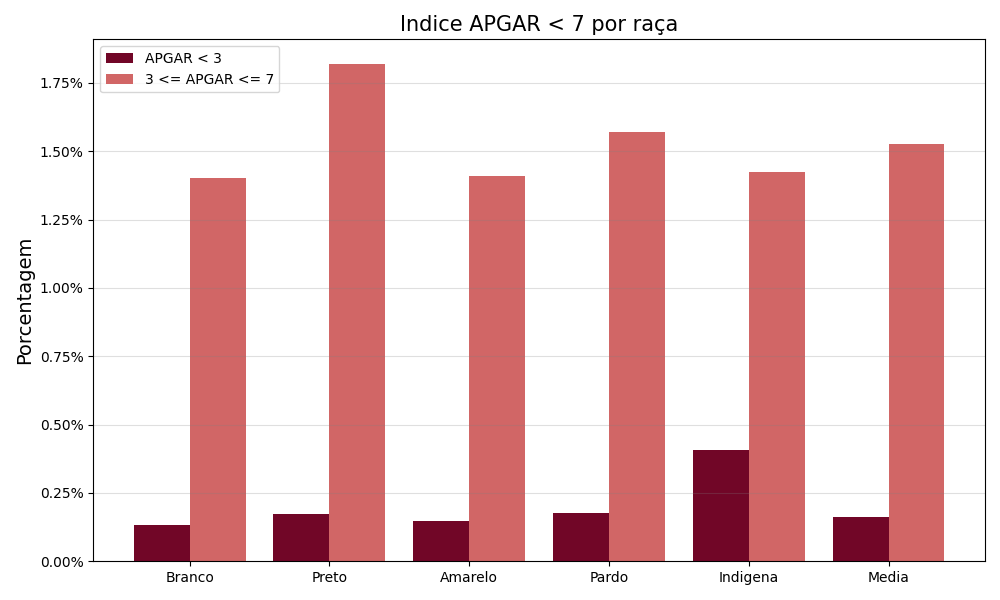
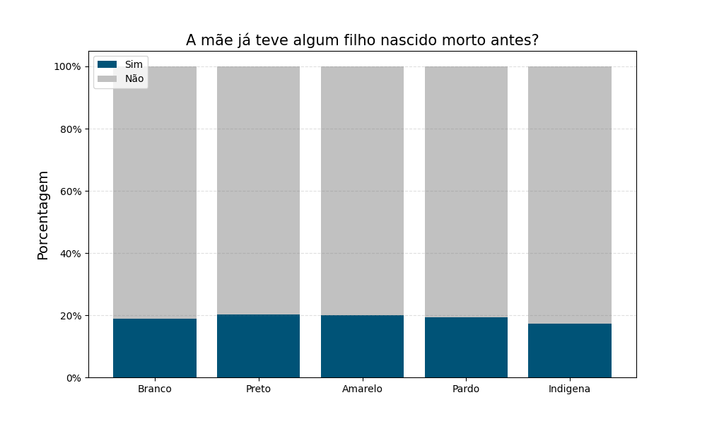
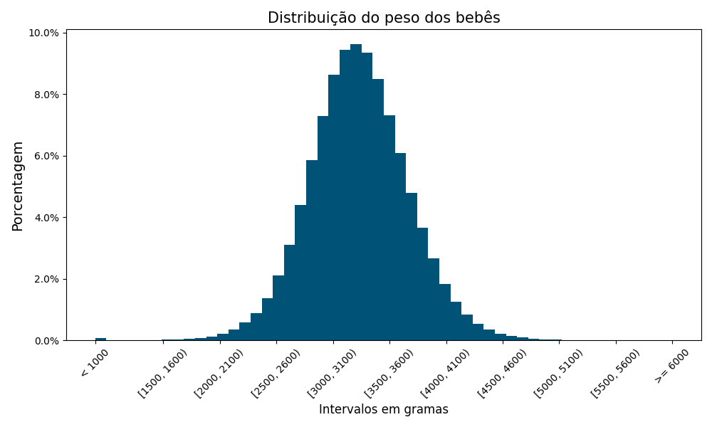

# Análise da saúde neonatal por cor

Dentre os vários parâmetros possíveis de se mensurar a saúde do recém-nascido optamos por utilizar o peso ao nascer, o índice APGAR e a quantidade total de nascidos, vivos ou não.

## Indice APGAR5

O índice APGAR avalia o ajuste imediato do recém-nascido à vida extrauterina, por isto é um acrônimo para **A**ppearance, **P**ulse, **G**rimace, **A**ctivity, **R**espiration. Normalmente é feito duas vezes, no 1º e no 5º minuto após o nascimento, e varia de 0 a 10 para indicar se existe uma asfixia grave (0 a 2), moderada (3 e 4), leve (5 a 7) ou inexistente (8 a 10) no bebê.

Sendo uma avaliação pontual, ele pode indicar se o recém-nascido requer atenção médica mais urgente ou não e é influenciado principalmente pelo risco da gravidez, pelas complicações que surgem no parto e a prematuridade do nascimento.
Embora o resultado da escala de APGAR não consiga prever problemas na saúde do bebê no futuro, existe um maior risco de doenças como paralisia cerebral e epilepsia quando os resultados são muito baixos.

Isto nos permite perguntar não só qual a proporção que os baixos valores atingem na população como também sua incidência entre os diferentes grupos que a compõem. Escolhemos, por isso, analisar o APGAR5 em relação a raça/cor da mãe, pois Depois de trabalharmos com os dados, obtivemos o seguinte gráfico.

O que mais se destaca, a primeira vista, são os filhos de mães indigenas terem um maior proporção de APGAR < 3 do que a média e os filhos de mães pretas estarem acima da média com APGAR entre 3 e 5.
Num geral, ter $\approx 1.70$ dos recém nascidos com algum tipo de asfixia é algo relativamente baixo, já que os outros $\approx 98.30$ não apresentam nada, e os casos realmente graves de $\approx 0.20%$ são medicalmente preocupantes por representarem em torno de 4.000 nascidos. Apresentamos a tabela original para efeitos de comparação.

|    APGAR |      0 |      1 |      2 |      3 |      4 |      5 |      6 |      7 |      8 |        9 |       10 |
|:---------|-------:|-------:|-------:|-------:|-------:|-------:|-------:|-------:|-------:|---------:|---------:|
|   Branca |    254 |    509 |    295 |    280 |    544 |   1092 |   2045 |   7255 |  44297 |   331393 |   411525 |
|    Negra |     80 |    118 |     80 |     95 |   165  |    318 |    559 |   1773 |  11108 |    81479 |    64250 |
|  Amarela |      5 |      9 |      2 |      4 |    14  |      9 |     27 |     99 |    644 |     4823 |     5218 |
|    Parda |    633 |    948 |    640 |    610 |   1011 |   2148 |   3869 |  12300 |  72787 |   617692 |   556467 |
| Indígena |     48 |     16 |      8 |      7 |     11 |     32 |     50 |    152 |    864 |     7299 |     9230 |
|    TOTAL |   1020 |   1600 |   1025 |    996 |   1745 |   3599 |   6550 |  21579 | 129700 |  1042686 |  1046690 |

## Filhos nascidos mortos

Um importante dado demograficamente é quantos filhos a mãe tem antes de dar a luz ao atual. Outro, mais negligenciado mas não menos importante, são quantos filhos ela *deixou de ter* antes de ter o atual bebê. É importante então para a saúde pública saber quantas mulheres, ao dar a luz a um recém-nascido, já tiverem algum filho nascido morto antes e como isso impacta as diferentes raças/cores. Isolando a coluna QTDFILMORT presente nos nossos dados, conseguimos criar o seguinte gráfico.

Que é algo realmente impressionante: $\approx 20%$ das mães que deram a luz em 2021 já tiveram algum filho nascido morto antes, com pouca variação relativa entre as raças/cores. Como isto inclui, nas palavras dos organizadores dos microdados, o "número de perdas fetais e abortos" da mãe, essa informação nos ilumina sobre uma parte da maternidade - e da sociedade - pouco comentada e discutida entre as pessoas. Uma maior investigação sobre as correlaçãos dessa elevada proporção e suas origens se fazem necessárias. A tabela a seguir mostra os dados brutos da quantidade de mães por número de filho nascido morto.

|    Nº filhos mortos |        0 |       1 |      2 |      3 |     4 |    5 |    6 |   7 |  8 |  >8 |
|:--------------------|---------:|--------:|-------:|-------:|------:|-----:|-----:|----:|---:|----:|
|  Quantidade de mães |  1823141 |  351973 |  65325 |  13838 |  2938 |  727 |  145 |  16 |  5 |  23 |

## Distribuição do Peso

Inevitavelmente o peso do recém-nascido é um dos grandes definidores de sua saúde no curto prazo, tanto pelos problemas decorrentes do baixo peso quanto pelos do sobre peso. Por serem em geral influenciados pela prematuridade do nascimento, o tabagismo materno, infecções durante a gravidez ou alterações no metabolismo da mãe, podemos avalia-los como indicador de saúde tanto do bebê quanto da mãe.

Em geral se classifica como saúdavel um peso entre 2500 e 4000 gramas, sendo acima disto uma condição macrossomica e abaixo disto uma condição de baixo peso. Dividindo os pesos em intervalos de 100 gramas e agrupando os casos extremos (acima de 6000g e abaixo de 1000g), olhando apenas gestações de duração entre 39 e 41 semanas, pudemos plotar o seguinte histograma:

Que é uma distribuição bastante semelhante à curva normal. O fato da maioria estar dentro do intervalo [2500, 4000] nos diz que de fato ele engloba a maior parte dos recém-nascidos. A média é $3268,1352$g com desvio padrão de $442,24$, com poucos casos acima de 5000g ou abaixo de 1500g. Isto até podia ser esperado já que é um dado biológico afetado por vários fatores e eles seguem, em geral, a curva normal.

[Voltar](../README.md)