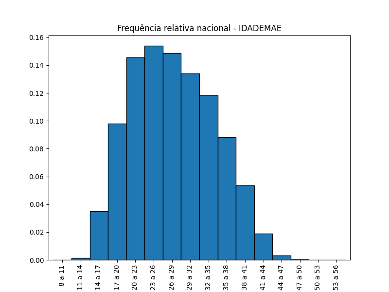
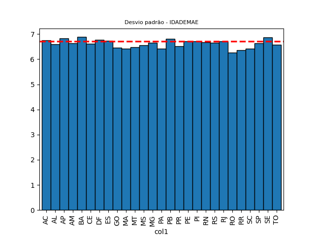
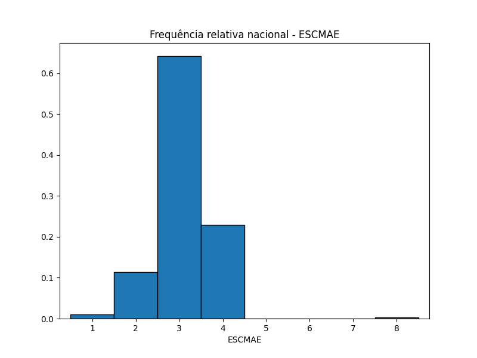
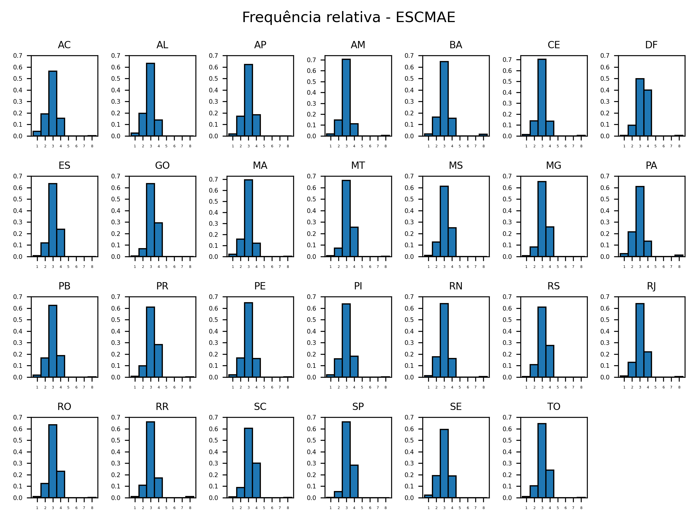
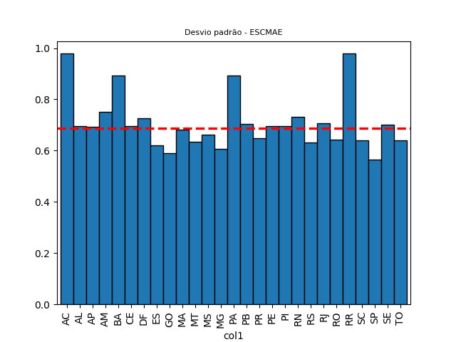
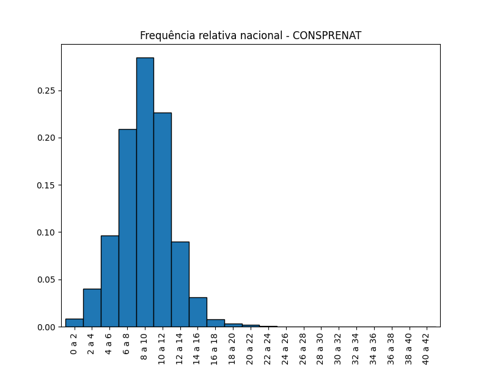
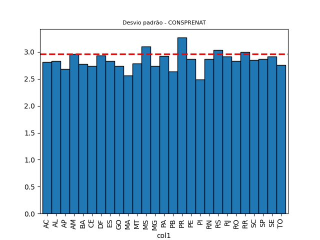

# Análise de dados

## Idade das mães
A tabela a seguir mostra algumas estatísticas nacionais com respeito a idade das mães em 2021.

|                | Idade das mães   |
|:---------------|-----------------:|
|  Média         |    27.238        |
| Desvio padrão  |     6.713        |
|  menor idade   |        8         |
|  25% percentil |        22        |
| mediana        |        27        |
|  75% percentil |        32        |
| maior idade    |        55        |

Os percentils indicam que 25% das mães têm idade igual ou abaixo de 2 e que 75% das mães têm idade igual ou inferior a 32 anos.
A plotagem do histograma das idades nos mostra uma considerável dispersão em torno da média devido ao desvião padrão de 6.713.

Podemos perceber que o desvio padrão dos Estados difere muito pouco do desvio nacional, indicando igual distribuição em torno da média.

A análise revela, portanto, uma ampla variação nas idades das mães no Brasil, com uma concentração significativa em torno da média. Além disso, evidencia que a distribuição de idades é relativamente uniforme em todos os estados do país. 

## Escolaridade das mães

A visualização do histograma da frequência relativa da escolaridade das mães mostra uma forte concentração em torno da média. De fato, o desvio padrão de 0,6867 indica tal concentração.

| Brasil        |            |
|:--------------|-----------:|
| Desvio padrão | 0.687      |
| Média         | 8 a 11 anos|

Podemos perceber que a distribuição relativa da escolaridade por Estado apresenta a maioria dos histogramas bem próximos ao da distribuição nacional.

Porém, o gráfico que mostra que o desvião padrão estadual revela que alguns Estados fogem bastante do desvio nacional.

Além disso, percebemos que os Estados mais distantes do desvio padrão nacional são AC, BA, PA, RR.
A tabela a seguir mostra seus desvios padrões.

|             |   AC  |   BA   |  PA  |  RR   |
|:------------|------:|-------:|-----:|------:|
|Desvio padrão| 0.978 | 0.893  |0.892 | 0.978 |

No que diz respeito à escolaridade das mães, a análise aponta para uma concentração significativa em torno da média nacional, representada pelo baixo desvio padrão de 0,687. Embora a maioria dos estados mostre distribuições de escolaridade semelhantes à média nacional, alguns estados, como AC, BA, PA e RR, exibem uma maior dispersão, indicando variações relevantes na escolaridade das mães.

## Consultas pré-natal

A tabela a seguir mostra algumas estatísticas nacionais relacionadas às consultas pré-natal efetuadas em 2021.

|                          | Consultas pré-natal   |
|:-------------------------|----------------------:|
|  Média                   |         8.480         |
| Desvio padrão            |          2.961        |
|  menor nº de consultas   |           0           |
|  25% percentil           |            7          |
| mediana                  |            8          |
|  75% percentil           |           10          |
| maior nº de consultas    |           41          |

Embora tenhamos números de consultas que variam de 0 a 41, o baixo desvio padrão mostra uma alta concentração em torno da média. Isso é evidenciado pelo histograma nacional, que está consideravelmente afastado do valor 41. Essa concentração em torno da média é sustentada pelo terceiro percentil, que indica que 75% das mães realizam 10 ou menos consultas pré-natal.

O gráfico do desvio padrão dos Estados sugere uma homogeneidade na distribuição entre os Estados.

Concluímos então que os dados apontam para uma concentração significativa de consultas pré-natal em torno da média nacional, com uma baixa dispersão. Essa tendência é observada tanto a nível nacional quanto nos Estados, sugerindo que a atenção pré-natal é relativamente uniforme em todo o país.

[Voltar](../README.md)
