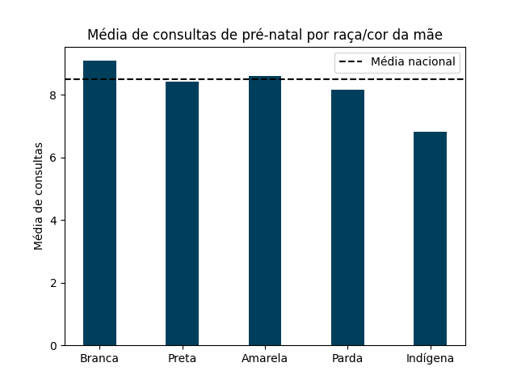
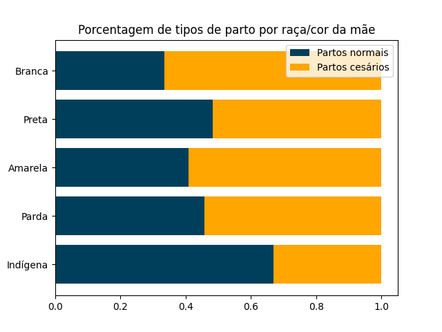

# Análise de dados

Vamos analisar a relação entre a raça/cor da mãe e os cuidados com a saúde materna. Para isso, vamos considerar três aspectos:
a quantidade de consultas pré-natal realizadas, o local de nascimento do bebê e o tipo de parto (normal ou cesário).

## Consultas pré-natal

A tabela abaixo mostra a quantidade de consultas pré-natal realizadas por raça/cor da mãe, junto com a média de consultas.

|   RACACORMAE |   NUMCONSULTAS |   NUMREGISTROS |   MEDIA |
|:-------------|---------------:|---------------:|--------:|
|       Branca |        7288007 |         802475 |    9,08 |
|        Negra |        1358606 |         161600 |    8,41 |
|      Amarela |          93870 |          10915 |    8,60 |
|        Parda |       10462514 |        1284167 |    8,15 |
|     Indígena |         146291 |          22497 |    6,50 |

Podemos plotar esses dados em um gráfico de barras para comparar as médias
entre as raças/cor e a média nacional de consultas.

Veja que a média nacional é de aproximadamente 8,48 consultas. Mas o número de consultas pré-natal varia bastante entre as raças/cor.
As mães brancas são as que mais realizam consultas pré-natal, com uma média de 9,08 consultas. Já as mães indígenas são as que menos 
realizam consultas pré-natal, com uma média de 6,50 consultas. Isso se deve ao fato de que muitas das mães indígenas vivem em regiões 
mais afastadas e de difícil acesso, o que dificulta o acesso aos serviços de saúde.

## Local de nascimento do bebê

A tabela abaixo mostra a quantidade de bebês nascidos em hospitais por raça/cor da mãe.

|   RACACORMAE |                LOCNASC |     NUMREGISTROS |
|:-------------|:-----------------------|-----------------:|
| Branca       | Hospital               |           795573 |
|              | Outros estab. de saúde |             3247 |
|              | Domicílio              |             2888 |
|              | Outros                 |              766 |
|              | Aldeia indígena        |                1 |
| Preta        | Hospital               |           159599 |
|              | Outros estab. de saúde |              886 |
|              | Domicílio              |              739 |
|              | Outros                 |              376 |
|              | Aldeia indígena        |                0 |
| Amarela      | Hospital               |            10780 |
|              | Outros estab. de saúde |               61 |
|              | Domicílio              |               56 |
|              | Outros                 |               18 |
|              | Aldeia indígena        |                0 |
| Parda        | Hospital               |          1266125 |
|              | Outros estab. de saúde |             9338 |
|              | Domicílio              |             6153 |
|              | Outros                 |             2550 |
|              | Aldeia indígena        |                1 |
| Indígena     | Hospital               |            17184 |
|              | Outros estab. de saúde |              407 |
|              | Domicílio              |             2856 |
|              | Outros                 |             1058 |
|              | Aldeia indígena        |              992 |

No gráfico abaixo, podemos ver a distribuição dos locais de nascimento dos bebês de mães indígenas.

Novamente podemos ver que as mães indígenas são as que menos utilizam os serviços de saúde. A maioria dos 
bebês nasce em hospitais, mas ainda assim, 21,8% dos bebês nascem em locais que não são estabelecimentos de 
saúde, como em casa ou em aldeias indígenas, e que podem não ter a estrutura necessária para garantir a 
segurança da mãe e do bebê.

## Tipo de parto

Agora vamos analisar o tipo de parto realizado. A tabela abaixo mostra a quantidade de partos normais e cesários que foram 
realizados em hospitais por raça/cor da mãe.

|   RACACORMAE |   QTDPARTNOR |   QTDPARTCES |
|:-------------|-------------:|-------------:|
|       Branca |       266654 |       528919 |
|        Preta |        77138 |        82461 |
|      Amarela |         4416 |         6364 |
|        Parda |       581025 |       685100 |
|     Indígena |        11621 |         5563 |

No gráfico abaixo, podemos ver a proporção de cada tipo de parto por raça/cor da mãe.

As mães brancas são as que mais realizaram partos cesários, com 66,5% dos partos sendo cesários. Já as mães indígenas são as que menos
realizaram esse tipo de procedimento, com somente 32,1% dos partos sendo cesários. No total, 59,8% dos partos realizados em hospitais
são do tipo cesário, e os outros 40,2% são do tipo normal.

[Voltar](../README.md)